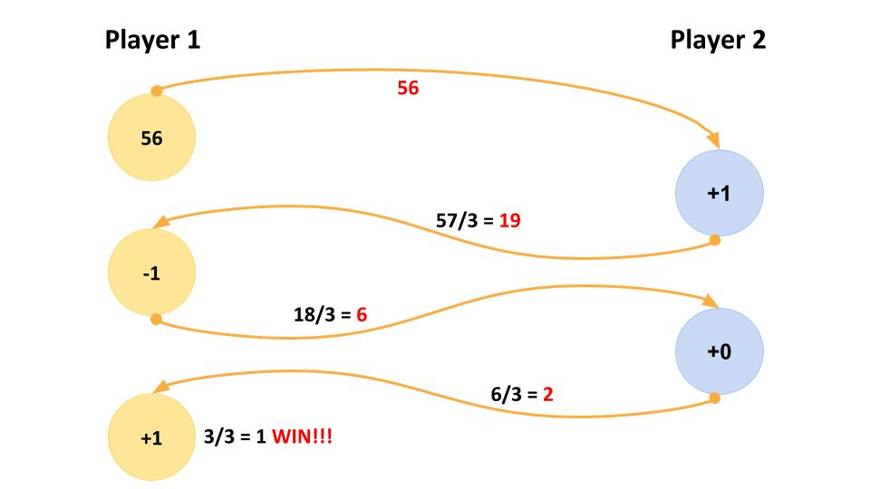

# Game of Three

## Takeaway.com coding challenge

### Goal
The Goal is to implement a game with two independent units – the players – communicating with each other using an API.

### Description
When a player starts, it incepts a random (whole) number and sends it to the second player as an approach of starting the game. The receiving player can now always choose between adding one of​ {­1, 0, 1} to get to a number that is divisible by​ 3. Divide it by three. The resulting whole number is then sent back to the original sender. The same rules are applied until one player reaches the number 1 (after the division). See example below.

For each "move", a sufficient output should get generated (mandatory: the added, and the resulting number).

Both players should be able to play automatically without user input. One of the players should optionally be adjustable by a user.

### Notes
- Each player runs on its own (independent programs, two browsers, web‐workers, etc.);
- Communication via an API (REST, Sockets, WebRTC, etc.);
- A player may not be available when the other one starts;
- If you are applying for a frontend position, think of a fancy​ easily​ configurable layout. Otherwise terminal output is okay;
- Please share your project on GitHub and send us the link;
- Try to be platform independent, in other words the project must be runnable easily in every environment.

## Additional notes, based on correspondence
- A player can choose to either play against computer or against another player;
- If a player choose to play against another human player, then the game does not start until both are connected/online.
